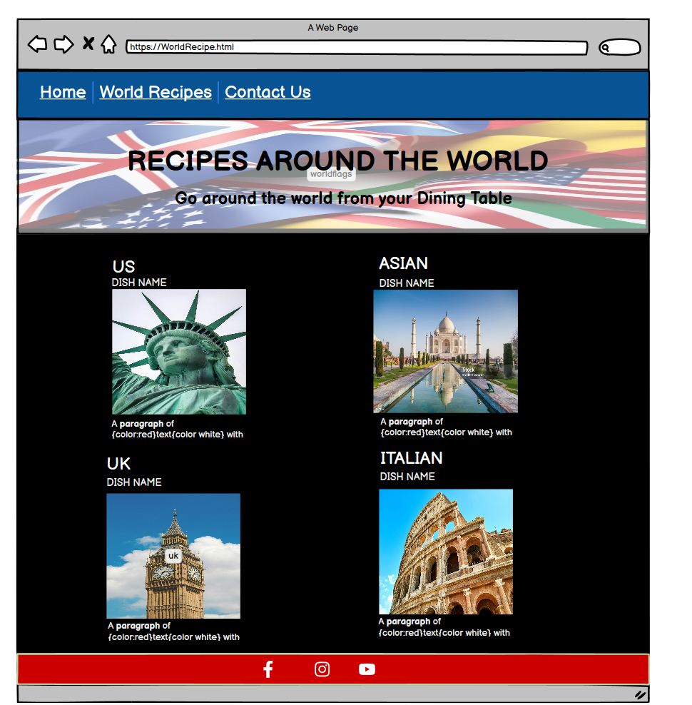
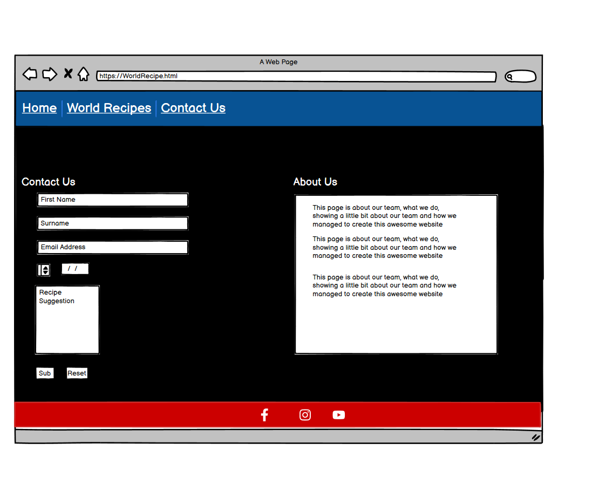
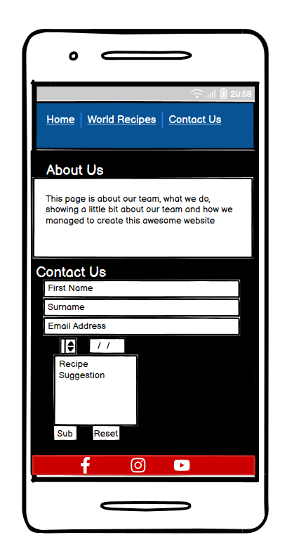
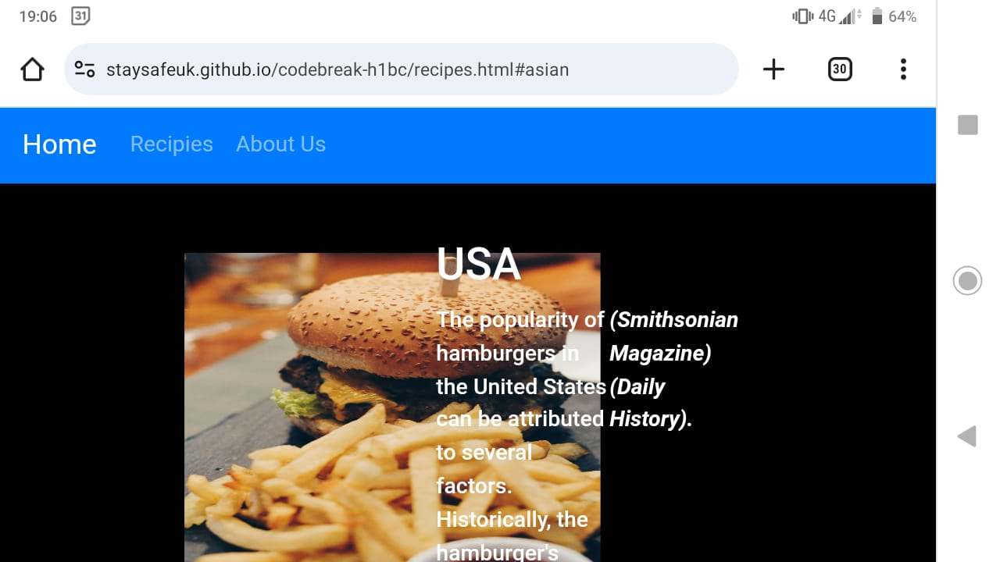

 
 ## Wireframes
    
  - Landing Page Wireframe
  

  
  

  - Recipe Page Wireframe

  

  
  
  

  
   - ContactUs Page Wireframe

  

  
  
  

  

  ## Am I Responsive
    
  - Landing Page Responsive Testing
  

  

  - Recipes Page Responsive Testing

  

  
  

  
   - ContactUs Responsive Testing

  

  
  

  

  ## During development and testing, we found these bugs and fixed:

### Overlapping text over image

- When the browser resize and make smaller the right hand side coloumn takes over and overlapped.
This is not a good user experience & we managed to fix in development. 

  

  
  

  This bug on the image checked by using medium size device.

# Sources Credit #

Our recipes and ingredients list from https://www.bbcgoodfood.com/recipes/ 

/* Roast Beef */

Photo by Sebastian Coman Photographyon <a href="https://unsplash.com/photos/cooked-food-on-white-ceramic-plate-CRoAeTh5S_I?utm_content=creditCopyText&utm_medium=referral&utm_source=unsplash">Unsplash</a>

https://www.thespruceeats.com/history-of-the-british-sunday-roast-4149600

/* Burger & Chip */

Photo by <a href="https://unsplash.com/@angelopantazis?utm_content=creditCopyText&utm_medium=referral&utm_source=unsplash">Angelo Pantazis</a> on <a href="https://unsplash.com/photos/burger-with-fries-on-brown-wooden-plank-gMCO0iXeo_c?utm_content=creditCopyText&utm_medium=referral&utm_source=unsplash">Unsplash</a>
  
/* Spaghetti Bolognese */
Photo by <a href="https://unsplash.com/@paishzaini?utm_content=creditCopyText&utm_medium=referral&utm_source=unsplash">Paish Zaini</a> on <a href="https://unsplash.com/photos/a-white-plate-topped-with-spaghetti-and-tomatoes--9UJTnXpUXM?utm_content=creditCopyText&utm_medium=referral&utm_source=unsplash">Unsplash</a>
  

/* Chicken Korma */

https://pikwizard.com/s/photo/chicken+korma/

# Future Features #

- Our team would like to add a toggle dropdown effect on Recipe on navigation bar that allows the user to be able to explore more without having to go down the page and search .It will also encourage user to suggest more of their choice if they couldn't find what they want.

- In Order to give user a pleasant experiece of their visit to the page development team would like to make imporovement on our button style to be more visually appealing.

