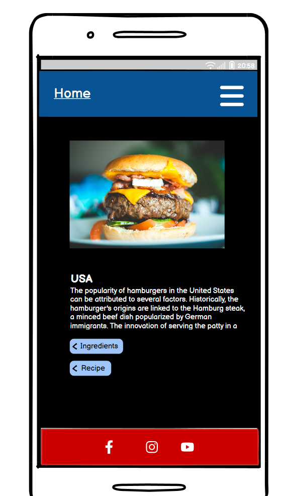

 
 ## Wireframes
    
  - Landing Page Wireframe
  

  
  

  - Recipe Page Wireframe

  

  
  
  

  
   - ContactUs Page Wireframe

  

  
  
  

  

  ## Am I Responsive
    
  - Landing Page Responsive Testing
  

  

  - Recipes Page Responsive Testing

  

  
  

  
   - ContactUs Responsive Testing

  

  
  

  