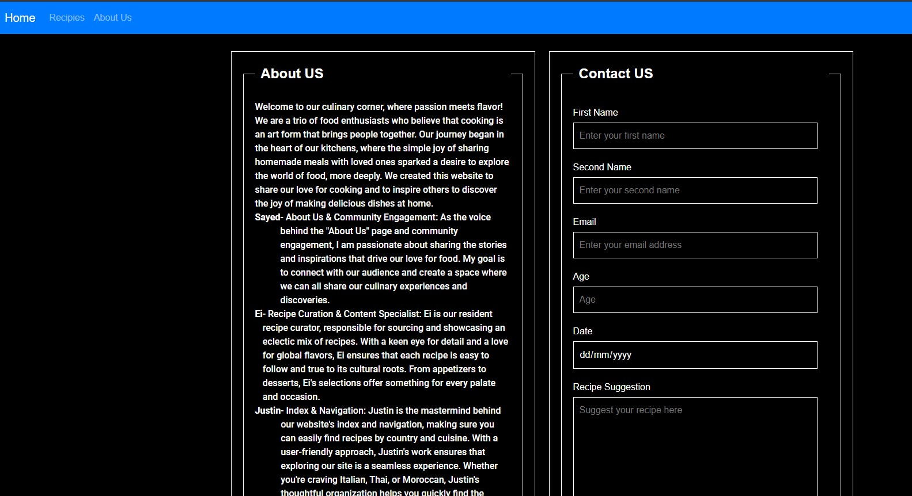
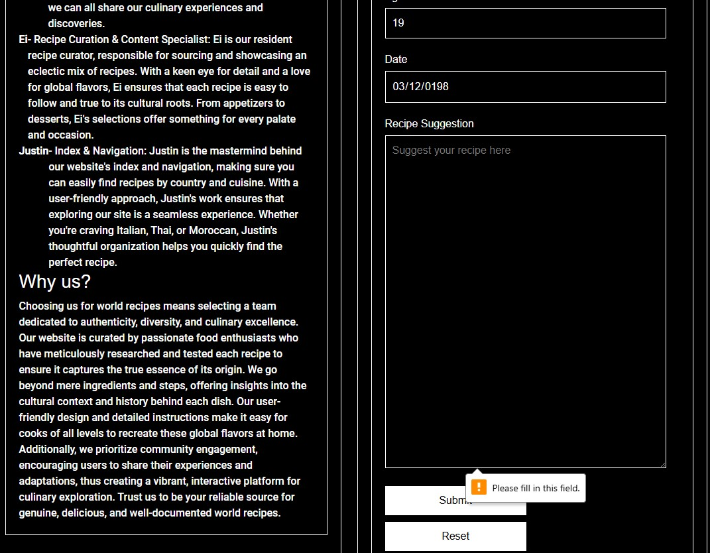

## Testing

### Introduction
Testing is a critical aspect of our development process, ensuring that our website operates smoothly and delivers a seamless user experience. Our website, which features a home page, a recipes page, and an about us page, undergoes rigorous testing to identify and resolve issues before deployment. We employ various testing methodologies, including unit tests, integration tests, and end-to-end tests, to cover all aspects of functionality and user interactions. By maintaining a robust testing suite, we aim to provide a reliable and enjoyable experience for our users as they explore different cultural recipes.

Ensuring the functionality and user experience of our website is of utmost importance. Our website, which features recipes and culinary insights from various cultures, is structured into three main pages: the Home Page, Recipes Page, and About Us Page. Below is a comprehensive guide to the testing procedures carried out to validate the performance, usability, and reliability of each section of the website.

### Insight
Our website is designed to be an engaging and informative platform for food enthusiasts and home cooks. To guarantee that users have a seamless and enjoyable experience, we conducted extensive testing on each of the three primary pages:

Home Page: The entry point to our website, showcasing featured recipes, cultural highlights, and a navigation menu.
Recipes Page: A detailed directory of recipes categorized by culture, ingredients, and cooking methods, complete with search functionality.
About Us Page: Information about our team, mission, and the inspiration behind our culinary journey.

The following sections outline the different types of testing performed, including functional, usability, and performance testing, along with the specific methodologies and tools employed.

### Functional Testing

Functional testing is a critical process in the software development lifecycle aimed at verifying that each feature of the website operates in conformance with the required specifications. This type of testing focuses on the user interface, APIs, databases, security, client/server applications, and overall functionality of the website. By systematically assessing each component, functional testing ensures that all aspects of the website, such as navigation links, forms, search features, and interactive elements, work correctly and deliver the expected results. The primary goal is to identify any discrepancies or defects in the application's functionality, thereby ensuring a seamless and error-free user experience. Functional testing is typically carried out using both manual testing and automated tools to cover a wide range of scenarios and use cases.

### Landing Page

The Home Page serves as the gateway to our website, and ensuring its functionality is crucial for providing a positive user experience. During functional testing of the Home Page, we meticulously verified that the navigation menu links to the correct pages, allowing users to effortlessly explore different sections of the site, such as the Recipes Page and the About Us Page. Additionally, we ensured that the featured cuisine names displayed prominently on the Home Page direct users to the correct recipe details pages. Each recipe detail page was checked to confirm that it loads properly and displays all necessary information, including ingredients, preparation steps, and cultural context. This comprehensive testing guarantees that users can easily find and access the content they are interested in, enhancing their overall experience on the website.

### Recipes Page
The Recipes Page is a comprehensive directory showcasing a variety of cuisines, each accompanied by detailed information and two interactive features: Ingredients and Recipes. During functional testing, we meticulously verified that all components of this page operate seamlessly. Each cuisine listed on the Recipes Page correctly displays pertinent information and offers two clickable features: 'Ingredients' and 'Recipes'. Clicking on 'Ingredients' accurately reveals the list of ingredients used in the respective cuisine, while clicking on 'Recipes' displays the step-by-step instructions necessary to prepare the dishes. We tested all four cuisines available on the page to ensure that these interactive elements function correctly and consistently across all entries. This thorough testing guarantees that users can easily access and utilize the information and features provided, enhancing their culinary experience on our website.

### About Us page

The About Us Page provides insights into our team and mission, and includes a user form designed for collecting recipe suggestions. During functional testing of this page, we ensured that all form elements work as intended. The form fields include Name, Surname, Email, Age, Date, and Recipe Suggestion. We rigorously tested each field to confirm that submitting the form with any missing information triggers appropriate error messages, ensuring that users are prompted to complete all required fields. Additionally, we validated the email field to verify that an error is displayed if the entered email format is incorrect. The functionality of the Reset button was tested to ensure it clears all form fields, while the Submit button was tested to confirm it successfully submits the form data to the database. This testing process ensures that the form is user-friendly, robust, and reliably captures all necessary user input.

## Code

### Landing Page

The HTML validation for the Landing Page was conducted using the W3C Markup Validation Service to ensure compliance with web standards. The validation results indicate that the HTML code passed all checks without any errors or warnings. The primary issues identified were informational, noting that trailing slashes on void elements (such as meta tags and link tags) have no effect and may interact badly with unquoted attribute values. These messages are purely informational and do not affect the functionality or compliance of the HTML code. Successfully passing the validation confirms that the Landing Page adheres to best practices and standards, ensuring it is well-structured, accessible, and compatible across different browsers and devices. This compliance contributes to the overall reliability and quality of the website.

