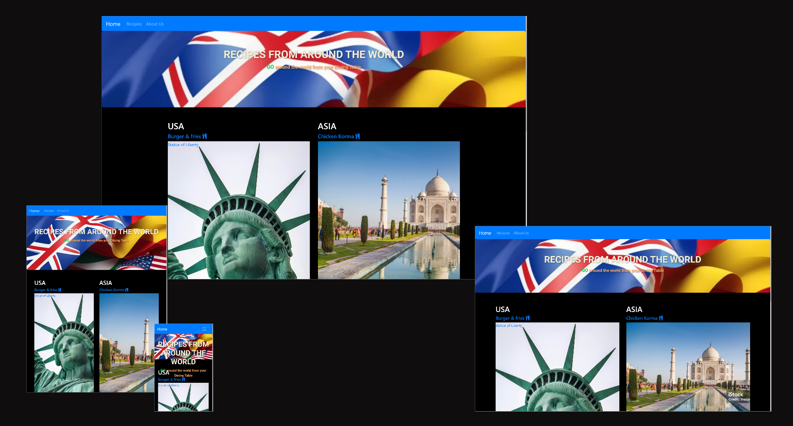
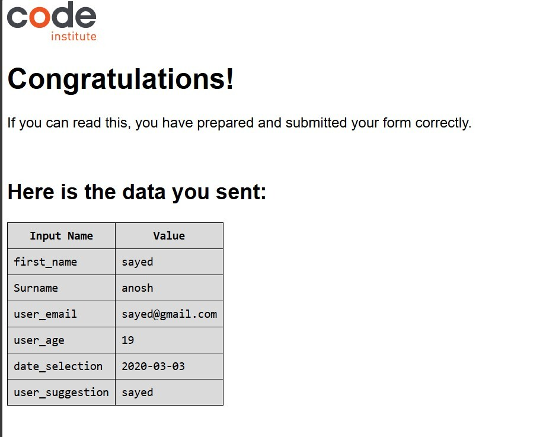
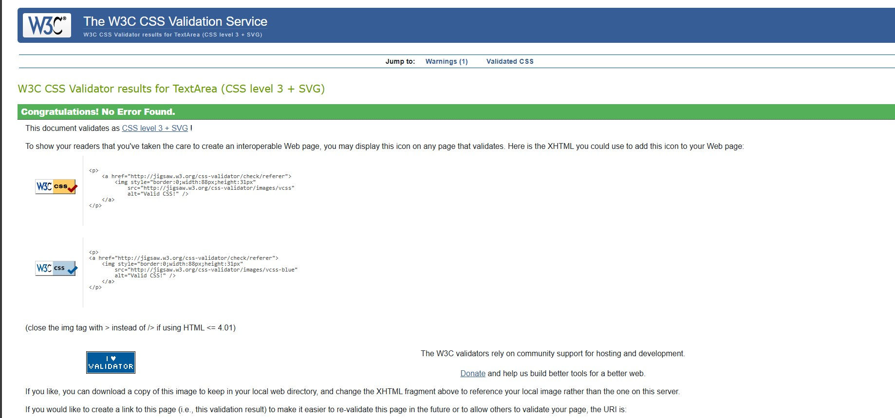

# TABLE OF CONTENTS

## 1. USER GOALS

- The users goal is to display recipes from around the world from four locations.
- The users goal is to be able to navigate the website quickly and effectively accross the site
- The users goal is to be able to view recipes effectively and clearly 
- The users goal is to be able to contact our team to add new recipes

## 2. SITE OWNER GOALS

- The site owners goal is to have a clean concisive site with recipe content from four locations around the world
- The site owner goal is to take feedback from users and provide an opportunity to recieve feedback and new recepies.

# Features

## INDEX PAGE
## Clickable Hyperlinks 
The index page features clickable images, and links that divert directly to the recipes location, i.e if you click on 
the USA image or link, the page will goto USA on recipes page, this works across all locations. 

## Responsive design
Our index page was designed on mobile first principles, and is fully responsive on all devices,  this gives us the 
ability to increase our market share as the majority of internet users are mobile first, tablets and desktops second. 

## RECIPES PAGE
## Drop down menus for ingredients and method
The recipes html page has a carousal for dropdowns to ingredients (which are ordered with an unordered list) and method,
This gives the user the ability to save screen space and gives interraction making the site fun and enjoyable to use.

## Responsive design 
Mobile first was a design consideration at the UI UX stage of design, and was considered, due to the ambitious nature of
using drop down menus with Bootstrap, the recipes.html page is mainly responsive, and works accross the majority of mobile
devices

## CONTACTUS PAGE
## Validation for key fields of entry
The contact us page has validation fields used throughout the form design, stopping incorrect data being entered into the 
fields,  the contactus page also will not accept a submit until all the key fields are entered in the correct format.

## Clear Form 
The contact us page also features a clear form button, where if the user decides not to submit the form or has made an 
error the form can be cleared and all entries removed.

## Responsive design

The contact us page has been designed with mobile first design considerations, the form and about us page is responsive to
most screen sizes.

# UX/UI

## 1. Target Audience
- People looking for a new meal from a new culture
- People specifically looking for a new recipe
- People whom would like to learn some new information regarding the culture where the dishes originate from
- Foodies 

## 2. User Stories
- EPIC Clear appealing recipes site where where users can find recipes from around the world
- Collapse feature for showing more detwils about the recipe and ingredients
- Contact form to be used to contact our team regarding new recipes and any other queries
- Navigation to be used throughout the pages on the site
- Recipes clearly defined and styled with bullet points
- Header and footer

## 3. Design choice

## Colour Scheme
- Initially we went with a green and blue colour scheme, however we had a change in the design process and went for a dark
theme using colours from the default Bootstrap information, warning etc.

## Fonts
- We decided to use Google Fonts Roboto for the default text accross our site Roboto Sans-serif font weight 600 as we wanted clear 
and easy to read font.
## Banner
- *Home Title* Roboto Sans-Serif 700 Bold was used with shadowing so it could be displayed against our AI build image.  

 
 ## 4. Wireframes
    
  - Landing Page Wireframe
  

  
  

  - Recipe Page Wireframe

  

  
  
  

  
   - ContactUs Page Wireframe

  

  
  
  

  

  ## Am I Responsive
    
  - Landing Page Responsive Testing
  

  

  - Recipes Page Responsive Testing

  

  
  

  
   - ContactUs Responsive Testing

  

  
  

  

  ## During development and testing, we found these bugs and fixed:

### Overlapping text over image

- When the browser resize and make smaller the right hand side coloumn takes over and overlapped.
This is not a good user experience & we managed to fix in development. 

  

  
  

  This bug on the image checked by using medium size device.

# Sources Credit #

Our recipes and ingredients list from https://www.bbcgoodfood.com/recipes/ 

/* Roast Beef */

Photo by Sebastian Coman Photographyon <a href="https://unsplash.com/photos/cooked-food-on-white-ceramic-plate-CRoAeTh5S_I?utm_content=creditCopyText&utm_medium=referral&utm_source=unsplash">Unsplash</a>

https://www.thespruceeats.com/history-of-the-british-sunday-roast-4149600

/* Burger & Chip */

Photo by <a href="https://unsplash.com/@angelopantazis?utm_content=creditCopyText&utm_medium=referral&utm_source=unsplash">Angelo Pantazis</a> on <a href="https://unsplash.com/photos/burger-with-fries-on-brown-wooden-plank-gMCO0iXeo_c?utm_content=creditCopyText&utm_medium=referral&utm_source=unsplash">Unsplash</a>
  
/* Spaghetti Bolognese */
Photo by <a href="https://unsplash.com/@paishzaini?utm_content=creditCopyText&utm_medium=referral&utm_source=unsplash">Paish Zaini</a> on <a href="https://unsplash.com/photos/a-white-plate-topped-with-spaghetti-and-tomatoes--9UJTnXpUXM?utm_content=creditCopyText&utm_medium=referral&utm_source=unsplash">Unsplash</a>
  

/* Chicken Korma */

https://pikwizard.com/s/photo/chicken+korma/

# Future Features #

- Our team would like to add a toggle dropdown effect on Recipe on navigation bar that allows the user to be able to explore more without having to go down the page and search .It will also encourage user to suggest more of their choice if they couldn't find what they want.

- In Order to give user a pleasant experiece of their visit to the page development team would like to make imporovement on our button style to be more visually appealing.

## 5. Testing

### Introduction
Testing is a critical aspect of our development process, ensuring that our website operates smoothly and delivers a seamless user experience. Our website, which features a home page, a recipes page, and an about us page, undergoes rigorous testing to identify and resolve issues before deployment. We employ various testing methodologies, including unit tests, integration tests, and end-to-end tests, to cover all aspects of functionality and user interactions. By maintaining a robust testing suite, we aim to provide a reliable and enjoyable experience for our users as they explore different cultural recipes.

Ensuring the functionality and user experience of our website is of utmost importance. Our website, which features recipes and culinary insights from various cultures, is structured into three main pages: the Home Page, Recipes Page, and About Us Page. Below is a comprehensive guide to the testing procedures carried out to validate the performance, usability, and reliability of each section of the website.

### Insight
Our website is designed to be an engaging and informative platform for food enthusiasts and home cooks. To guarantee that users have a seamless and enjoyable experience, we conducted extensive testing on each of the three primary pages:

Home Page: The entry point to our website, showcasing featured recipes, cultural highlights, and a navigation menu.
Recipes Page: A detailed directory of recipes categorized by culture, ingredients, and cooking methods, complete with search functionality.
About Us Page: Information about our team, mission, and the inspiration behind our culinary journey.

The following sections outline the different types of testing performed, including functional, usability, and performance testing, along with the specific methodologies and tools employed.

### Functional Testing

Functional testing is a critical process in the software development lifecycle aimed at verifying that each feature of the website operates in conformance with the required specifications. This type of testing focuses on the user interface, APIs, databases, security, client/server applications, and overall functionality of the website. By systematically assessing each component, functional testing ensures that all aspects of the website, such as navigation links, forms, search features, and interactive elements, work correctly and deliver the expected results. The primary goal is to identify any discrepancies or defects in the application's functionality, thereby ensuring a seamless and error-free user experience. Functional testing is typically carried out using both manual testing and automated tools to cover a wide range of scenarios and use cases.

### Landing Page

The Home Page serves as the gateway to our website, and ensuring its functionality is crucial for providing a positive user experience. During functional testing of the Home Page, we meticulously verified that the navigation menu links to the correct pages, allowing users to effortlessly explore different sections of the site, such as the Recipes Page and the About Us Page. Additionally, we ensured that the featured cuisine names displayed prominently on the Home Page direct users to the correct recipe details pages. Each recipe detail page was checked to confirm that it loads properly and displays all necessary information, including ingredients, preparation steps, and cultural context. This comprehensive testing guarantees that users can easily find and access the content they are interested in, enhancing their overall experience on the website.

### Recipes Page
The Recipes Page is a comprehensive directory showcasing a variety of cuisines, each accompanied by detailed information and two interactive features: Ingredients and Recipes. During functional testing, we meticulously verified that all components of this page operate seamlessly. Each cuisine listed on the Recipes Page correctly displays pertinent information and offers two clickable features: 'Ingredients' and 'Recipes'. Clicking on 'Ingredients' accurately reveals the list of ingredients used in the respective cuisine, while clicking on 'Recipes' displays the step-by-step instructions necessary to prepare the dishes. We tested all four cuisines available on the page to ensure that these interactive elements function correctly and consistently across all entries. This thorough testing guarantees that users can easily access and utilize the information and features provided, enhancing their culinary experience on our website.

### About Us page

The About Us Page provides insights into our team and mission, and includes a user form designed for collecting recipe suggestions. During functional testing of this page, we ensured that all form elements work as intended. The form fields include Name, Surname, Email, Age, Date, and Recipe Suggestion. We rigorously tested each field to confirm that submitting the form with any missing information triggers appropriate error messages, ensuring that users are prompted to complete all required fields. Additionally, we validated the email field to verify that an error is displayed if the entered email format is incorrect. The functionality of the Reset button was tested to ensure it clears all form fields, while the Submit button was tested to confirm it successfully submits the form data to the database. This testing process ensures that the form is user-friendly, robust, and reliably captures all necessary user input.

## Code

### Landing Page

The HTML validation for the Landing Page was conducted using the W3C Markup Validation Service to ensure compliance with web standards. The validation results indicate that the HTML code passed all checks without any errors or warnings. The primary issues identified were informational, noting that trailing slashes on void elements (such as meta tags and link tags) have no effect and may interact badly with unquoted attribute values. These messages are purely informational and do not affect the functionality or compliance of the HTML code. Successfully passing the validation confirms that the Landing Page adheres to best practices and standards, ensuring it is well-structured, accessible, and compatible across different browsers and devices. This compliance contributes to the overall reliability and quality of the website. 

In addition to HTML validation, the CSS code for the Landing Page was also rigorously tested using the W3C CSS Validation Service. The validation process ensures that the CSS adheres to the standards set by the W3C, promoting best practices in styling and layout. The results of the CSS validation indicated that there were no errors or warnings, confirming that the stylesheets are syntactically correct and compatible across different browsers. This successful validation ensures that the visual presentation of the website is consistent and reliable, providing users with a seamless and aesthetically pleasing experience. By adhering to W3C standards, we ensure that our website is robust, maintainable, and accessible, enhancing the overall quality and performance of the site.

### Recipes Page

The HTML code for the "recipes" page has been successfully tested using the W3C Nu HTML Checker. The validation results indicate that the code passed all major checks, with only minor informational and warning messages. Specifically, there was an informational note about the trailing slash on a meta tag, which is harmless and does not affect the document's validity. Additionally, a warning was flagged regarding the first occurrence of an ID, "ingredients-header," indicating proper attention to unique ID usage. Overall, these minor notes do not detract from the fact that the HTML code conforms to current web standards, ensuring a well-structured and valid document.

The CSS code for the "recipe" page has been validated and deemed fully compliant with current web standards. The validation process confirmed that the stylesheet contains valid syntax, with no significant errors or warnings impacting its performance. This indicates that the CSS rules are well-structured and correctly applied, ensuring a consistent and visually appealing layout across different browsers and devices. The validation results highlight the developer's adherence to best practices in CSS development, providing a solid foundation for styling the page effectively. Overall, the CSS code's validity guarantees that the styling is both functional and reliable, contributing to a seamless user experience on the "recipe" page.

### About Us Page

The "About Us" page has undergone validation using the W3C Nu HTML Checker, and the results demonstrate a commendable level of adherence to HTML standards. The checker flagged only minor informational messages, specifically regarding the use of trailing slashes on void elements, such as <meta> and <link>. These notes are not errors but rather advisories that trailing slashes on void elements do not have an effect and can cause issues when combined with unquoted attribute values. However, in this context, they do not impair functionality or compliance with standards.

The presence of a meta tag for the page description and a link to external stylesheets, including Google Fonts and Font Awesome, showcases the developer's commitment to ensuring a rich and visually appealing user experience. The inclusion of multiple font families from Google Fonts, combined with the use of Bootstrap for responsive navigation, indicates a focus on accessibility and design consistency across different devices and screen sizes.

Moreover, the document structure adheres to modern HTML5 practices, ensuring that the content is both semantic and accessible. The use of appropriate classes, such as navbar, navbar-expand-sm, and bg-primary, aligns with Bootstrap's framework, facilitating easy styling and modification. The implementation of a collapsible navigation bar is another example of thoughtful design, enhancing the user's ability to navigate the site efficiently.

Overall, the validation results reflect a robust and well-constructed HTML document, with minor suggestions that do not detract from the overall quality or usability of the page. The attention to detail in adhering to best practices while incorporating modern web technologies exemplifies a high standard of web development.

The CSS code for the "About Us" page has been thoroughly tested and has successfully passed the validation process, with the results indicating no errors or issues. The validator's congratulatory message confirms that the stylesheet adheres perfectly to all current standards, reflecting a meticulous attention to detail in the coding process. This error-free status underscores the developer's expertise in writing clean, efficient CSS, ensuring that the page's layout and styles render flawlessly across all modern browsers and devices. The absence of errors also means that the CSS rules are well-organized and compatible with best practices, facilitating a smooth and consistent user experience. Overall, the perfect validation outcome is a testament to the high quality and reliability of the "About Us" page's styling.

## Mobile device test

After testing our website on a mobile device, I'm pleased to report that it exhibits a high degree of responsiveness and user-friendliness. The content adjusts smoothly to the smaller screen, maintaining readability and functionality. The layout remains intact, with images and text scaling appropriately without any loss of quality or structure. Navigation is straightforward, with all links and buttons easily accessible, ensuring a seamless user experience.

The images, such as the prominent Big Ben photo for the UK section and the enticing hamburger image for the USA section, retain their clarity and impact, effectively engaging the viewer. The text wraps nicely, with no awkward breaks, maintaining a clean and professional look.

The contact form is particularly well-designed for mobile use, with input fields that are easy to tap and fill out. The form fields are properly spaced, preventing accidental selections and ensuring a smooth user interaction. Additionally, the inclusion of a drop-down menu for the date selection enhances usability, making it convenient for users to input their information accurately.

Moreover, the website's performance remains quick and responsive, with pages loading promptly, ensuring that users do not experience delays or frustration. The overall aesthetic and functionality on mobile devices mirror that of the desktop version, providing a consistent and engaging experience for users on the go.

Overall, the website performs excellently on mobile devices, providing a consistent and engaging experience for users on the go. This ensures that whether visitors access the site from their desktop or mobile device, they receive the same high-quality interaction, reflecting well on the site's design and technical execution.

The follwing screenshots have been taken on a mobile test:

